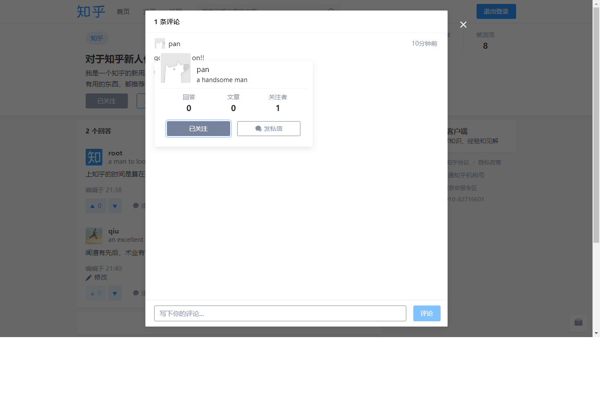

# zhihu
仿知乎网站

## 截图



## 项目结构
```
-zhihu
    |-config        配置文件
    |-controllers   控制器
    |-middleware    中间件
    |-models        数据库访问
    |-router        路由转发
    |-static        静态资源
    |-utils         实用工具
    |-vendor        项目依赖
    |-views         模板文件
    |-main.go       程序执行入口
```

## 安装
|软件依赖|
|:------:|
| Golang |
| MySQL |
| Redis |

本项目使用govendor管理依赖包
```
go get -u github.com/kardianos/govendor
```

```
go get -u github.com/gitobhub/zhihu
cd $GOPATH/src/github.com/gitobhub/zhihu
govendor sync
go run main.go
```

## Docker
```
docker pull dockerobhub/zhihuapp
docker pull dockerobhub/zhihudb
docker pull redis
```
```
docker network create zhihunet
docker run -d --name mysql --net zhihunet dockerobhub/zhihudb
docker run -d --name redis --net zhihunet redis
docker run -d --name zhihu --net zhihunet -p 8080:8080 -v $GOPATH:/go dockerobhub/zhihuapp
```

